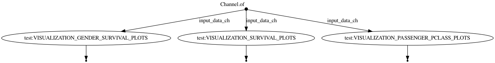
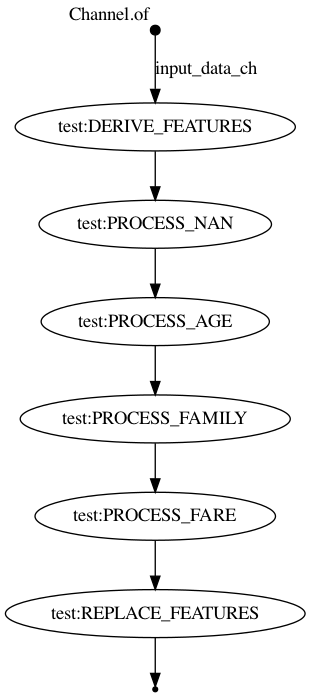
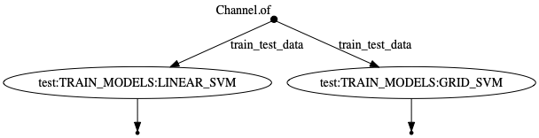

Nextflow driven analysis of titanic_dataset
==============================

This repo demonstrates the use of Nextflow in a Data Science scenario.

The foundation for this work is based on  [cookiecutter data science template](https://github.com/drivendata/cookiecutter-data-science) and the 
[Titanic dataset analysis](https://www.kaggle.com/ash316/eda-to-prediction-dietanic)

The core use-case for Nextflow in Data Science workflows are the following 

- **Reproducible**


- **Easy parallelization**

Once the preliminary notebook-based analysis is done and before scaling up the model development, Nextflow makes it simple to divide and parallelize the various aspects of the entire analysis.

For example, visualization oriented aspects could be extracted into a separate workflow to generate all the plots for `raw data` and `processed data` etc

```
main.nf
|
modules/
└── visualization
    ├── gender_survival_plots
    └── survival_plots
|
└── features
    ├── derive_features
    ├── process_age
    ├── process_family
    ├── process_fare
    ├── process_nan
    └── replace_features
|
|
workflows/
└── generate_plots
└── feature_engineering
```

- **Highly scalable**

Because of the `executor` abstraction in Nextflow, it's trivial to execute one process on AWS Batch, Kubernetes, traditional HPC clusters or even locally.


## Getting Started

Let's execute the main analysis locally with local data.

```
nextflow run main.nf -entry MAIN -params-file test_params.yml
```

#### Visualization workflow




#### Feature engineering workflow




#### Model training workflow



