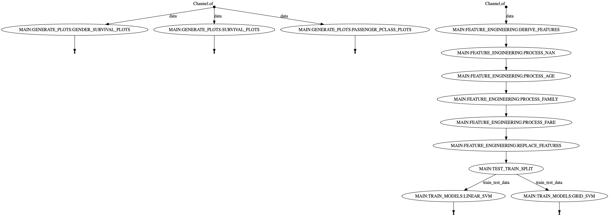

Nextflow driven analysis of titanic_dataset
==============================

This repo demonstrates the use of Nextflow in a Data Science scenario.

The foundation for this work is based on  [cookiecutter data science template](https://github.com/drivendata/cookiecutter-data-science) and the 
[Titanic dataset analysis](https://www.kaggle.com/ash316/eda-to-prediction-dietanic)

### Project structure

```
main.nf
|
modules/
└── data
    ├── test_train_split
    
└── visualization
    ├── gender_survival_plots
    └── survival_plots
|
└── features
    ├── derive_features
    ├── process_age
    ├── process_family
    ├── process_fare
    ├── process_nan
    └── replace_features
    
└── models
    ├── linear_svm
    └── grid_svm
    
workflows/
└── generate_plots
└── feature_engineering
└── train_models

```

## Getting Started

Let's execute the main analysis locally with local data.

```
nextflow run main.nf -entry MAIN -params-file test_params.yml
```

#### Visualization workflow


#### Feature engineering workflow


#### Model training workflow


### Overall workflow

The following diagram represents the entire workflow.



